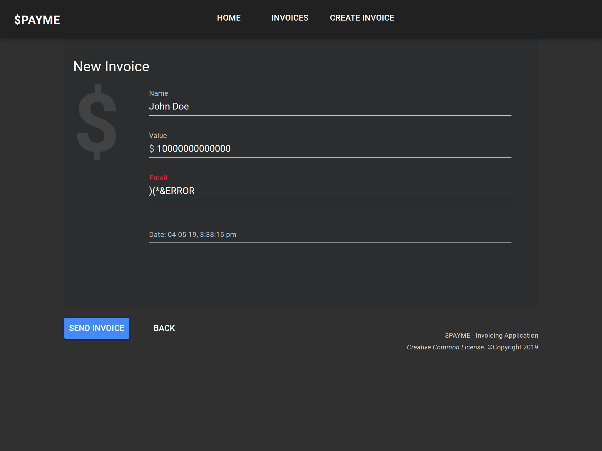
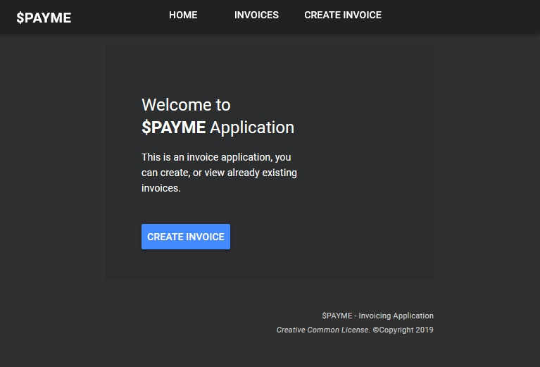

## PAYME Application

#### - [ Developed by Eaglex ](http://eaglex.net)

#### Overview

- Vue.js MVC invoicing application, enables you to create/delete/view invoices with properties: `name, value, email` . You can view list database and individual item routes. There are 4 page routes: `/home, /list,/item/{id},/create`. Application code has been documented.

<br/>

#### Depreciation notice and updates

This project is no longer maintained _(because Im busy building new exciting things!)._ If you find something is not working, please check release date of the project, and adjust to corresponding Node.js (even) version, then it should work.

If you are interested in my work and have questions about this project, **please drop me a comment, or email me, thanks!**

**Updates**

<i>Project demo is now available on github pages: </i>
**[ >> payme-app <<](https://eag1ex.github.io/payme-app)**

<br>



<br>
<br/>

#### Stack

- ES6, MVC, Vue.js v2 with Vuex, Vue-materials (beta), Lodash, Webpack, Bootstrap 4, Mock-backend, Firestore/FireBase Google Cloud > hosted on Node.js server, node.js/express.js

#### PAYME Live Demo

- Live demo is hosted on heroku node.js. _Server has a timeout limit_, you may have to logging again:

```sh

## INACTIVE
# access:
# https://blooming-journey-82987.herokuapp.com/login
# login: payme
# password: payme

```

#### Snapshot view on github pages

You can preview project on github pages, but doesnt work well in subdomain namespace.

[ payme-invoice ](https://eag1ex.github.io/payme-app/)

_Server API_

Server api is not available on github pages, it used to be hosed on heroku and firebase free dyno, but heroku discontinued offering that service.<br/>

You can take a look at the demo files for server logic here:
`/server_example_invoice-api/**`

#### Start/install application

```sh
$/ npm install
$/ npm start # will run dev server and open browser
$/ npm run build # will optimize all files for production
# you may need to install/ rebuild node-sass,
# if problems refer to "engines": { < in package.json or remove it and try again.
```

##### Requirements

```
$/ npm install webpack -g
$/ npm install -g vue-cli # not too sure if required
```

- install `eslint` for VSC

#### Webpack

- There are 4 files common, development, production, and config.

```js
externals: {
// this is injected into the application dynamicly, and api/base can be changed per build environment.
// global app config object
	config: JSON.stringify({
			apiUrl: API_BASE(),
			server: SERVER(),
			NODE_ENV: process.env.NODE_ENV
	})
},
```

##### RESt/API

- you can switch base api, to use either `LOCAL or REAL` in development environment.

##### mock-fake-backend

- to enable go to `webpack\config.js` > set `useServerInDev = "LOCAL"`, then run `npm start`.

##### LIVE-API

- to enable go to `webpack\config.js` > set `useServerInDev = "REAL"`, then run `npm start`.

#### Google Firestore/Firebase

- This application api runs on serverside firestore database, and it is served via express.js.
- i have included api logic in example files `./server_example_invoice-api` at root of application, sorry i cannot share with you all of node.js server, i use it on my other projects.<br/>

#### Hierarchy

- Application structure
  **vue module components:** `/app /create /404 /list /item/{id}`
  **services:** `/libs/_services/invoice.service.js`
  **vue store module:** `/libs/_store/invoice.module.js`
  **mock data:** `/libs/mock-data` < _initial invoice data for api/fake-backend.js_
  **fake-backend api:** `/libs/fake-backend.js`
  **/\/index.js:** `every libs service/module has index.js for export`
  **main ./index.js:** `root of application where all modules and plugins are imported in to.`
  **./libs/router.js:** `all components are imported to this file`
  **./libs/styles** `all style/css plugins are maintained here and exported via index.js, except for some of independant styles of components.`

#### Console

- debugging is enabled, you can see http request printed in console.

#### TESTS

- Tested on lates Chrome and Firefox

#### Bugs

- There is 1 bug in the early vue-materials plugin (still in beta), on /list route, when selecting and deleting you have to re-select again.

#### Thank you
